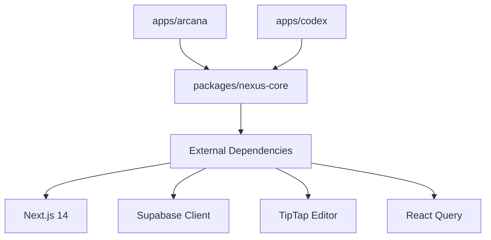

# Design Document

## Overview

This design outlines the restructuring of the NEXUS project from a single-application repository to a monorepo containing two distinct deployable applications (Arcana and Codex) sharing a common skeleton codebase. The restructuring enables the Skeleton Crew hackathon submission requirements while maintaining code reusability and independent deployment capabilities.

## Architecture

### Monorepo Structure

```
nexus/
├── .kiro/                          # Kiro configuration (visible for judges)
│   ├── specs/                      # Feature specifications
│   ├── hooks/                      # Agent hooks
│   ├── steering/                   # Steering documents
│   └── settings/                   # MCP and other settings
├── apps/
│   ├── arcana/                     # Personal knowledge base app
│   │   ├── nexus.config.yaml       # Arcana-specific config
│   │   ├── vercel.json             # Vercel deployment config
│   │   ├── package.json            # App dependencies
│   │   ├── public/                 # Static assets (logo, theme)
│   │   ├── seed-data.sql           # Arcana seed data
│   │   └── next.config.js          # Next.js config
│   └── codex/                      # API documentation app
│       ├── nexus.config.yaml       # Codex-specific config
│       ├── vercel.json             # Vercel deployment config
│       ├── package.json            # App dependencies
│       ├── public/                 # Static assets (logo, theme)
│       ├── seed-data.sql           # Codex seed data
│       └── next.config.js          # Next.js config
├── packages/
│   └── nexus-core/                 # Shared skeleton code
│       ├── src/
│       │   ├── app/                # Next.js App Router pages
│       │   ├── components/         # React components
│       │   ├── hooks/              # Custom React hooks
│       │   ├── lib/                # Utilities and services
│       │   ├── styles/             # Global styles
│       │   └── types/              # TypeScript types
│       ├── package.json            # Core package config
│       └── tsconfig.json           # TypeScript config
├── docs/
│   ├── SETUP_GUIDE.md              # User-friendly setup guide
│   ├── KIRO_USAGE.md               # Hackathon Kiro write-up
│   └── PROJECT_VALUE.md            # Value proposition documentation
├── scripts/
│   ├── setup-supabase.sql          # Database schema
│   └── seed.ts                     # Seeding script
├── package.json                    # Root workspace config
├── turbo.json                      # Turborepo config (optional)
└── README.md                       # Main documentation
```

### Dependency Flow



## Components and Interfaces

### Package: nexus-core

The core package exports all shared functionality:

```typescript
// packages/nexus-core/src/index.ts
export * from "./components";
export * from "./hooks";
export * from "./lib";
export * from "./types";
export * from "./app";
```

### App Configuration Interface

Each app provides its own configuration that the core package consumes:

```typescript
// packages/nexus-core/src/types/config.ts
interface NexusConfig {
  site: {
    title: string;
    description: string;
    logo: string;
    favicon: string;
  };
  mode: "personal" | "documentation";
  theme: ThemeConfig;
  layout: LayoutConfig;
  features: FeaturesConfig;
  navigation?: NavigationConfig;
  auth: AuthConfig;
  search: SearchConfig;
  mcp: MCPConfig;
}
```

### App Entry Point Pattern

Each app re-exports the core with its configuration:

```typescript
// apps/arcana/src/app/page.tsx
import { MainApp } from "@nexus/core";
import config from "../nexus.config";

export default function Page() {
  return <MainApp config={config} />;
}
```

## Data Models

### Workspace Package.json Structure

```json
{
  "name": "nexus-monorepo",
  "private": true,
  "workspaces": ["apps/*", "packages/*"],
  "scripts": {
    "dev:arcana": "npm run dev -w apps/arcana",
    "dev:codex": "npm run dev -w apps/codex",
    "build:arcana": "npm run build -w apps/arcana",
    "build:codex": "npm run build -w apps/codex",
    "build:all": "npm run build -w packages/nexus-core && npm run build:arcana && npm run build:codex"
  }
}
```

### Vercel Configuration Model

```json
{
  "buildCommand": "cd ../.. && npm run build:arcana",
  "outputDirectory": ".next",
  "installCommand": "cd ../.. && npm install",
  "framework": "nextjs"
}
```

## Correctness Properties

_A property is a characteristic or behavior that should hold true across all valid executions of a system-essentially, a formal statement about what the system should do. Properties serve as the bridge between human-readable specifications and machine-verifiable correctness guarantees._

Based on the prework analysis, the following testable properties have been identified:

### Property 1: Monorepo Structure Integrity

_For any_ valid monorepo setup, the `/apps/arcana`, `/apps/codex`, and `/packages/nexus-core` directories SHALL exist and contain the required configuration files.

**Validates: Requirements 1.1, 1.2, 1.3**

### Property 2: Independent App Functionality

_For any_ application in the `/apps` directory, building and running that application SHALL not require the other application to be present or built.

**Validates: Requirements 1.4, 2.5**

### Property 3: Shared Code Propagation

_For any_ modification to code in `packages/nexus-core`, rebuilding both applications SHALL reflect those changes in their respective builds.

**Validates: Requirements 6.4**

### Property 4: Workspace Dependency Resolution

_For any_ fresh clone of the repository, running `npm install` at the root SHALL successfully install all dependencies for all packages and applications.

**Validates: Requirements 6.2**

### Property 5: Vercel Configuration Validity

_For any_ application with a `vercel.json` file, the configuration SHALL be valid JSON that Vercel can parse and use for deployment.

**Validates: Requirements 2.1, 2.2**

### Property 6: Documentation Completeness

_For any_ required documentation file (SETUP_GUIDE.md, KIRO_USAGE.md), the file SHALL exist and contain all required sections as specified in the requirements.

**Validates: Requirements 3.1, 3.2, 3.3, 3.5, 4.1, 4.2, 4.3, 4.4, 4.5**

## Error Handling

### Build Errors

- **Missing Dependencies**: The workspace configuration ensures all dependencies are installed at the root level
- **Import Resolution**: TypeScript path aliases configured in each app to resolve `@nexus/core` imports
- **Configuration Errors**: YAML parsing errors in `nexus.config.yaml` are caught and reported with helpful messages

### Deployment Errors

- **Environment Variables**: Clear error messages when required environment variables are missing
- **Vercel Build Failures**: Documentation includes troubleshooting for common Vercel deployment issues

## Testing Strategy

### Dual Testing Approach

This project uses both unit tests and property-based tests:

1. **Unit Tests**: Verify specific examples and edge cases using Vitest
2. **Property-Based Tests**: Verify universal properties using fast-check

### Property-Based Testing Framework

- **Library**: fast-check (already compatible with Vitest)
- **Minimum Iterations**: 100 per property test
- **Test Location**: `__tests__/` folders adjacent to source files

### Unit Testing Requirements

Unit tests cover:

- Configuration parsing and validation
- Component rendering with different configs
- API route responses
- Utility function behavior

### Property-Based Testing Requirements

Each correctness property is implemented as a property-based test:

```typescript
// Example: Property 4 - Workspace Dependency Resolution
import { fc } from "fast-check";

/**
 * Feature: hackathon-submission, Property 4: Workspace Dependency Resolution
 * Validates: Requirements 6.2
 */
test("workspace dependencies resolve correctly", () => {
  // Property test implementation
});
```

### Test Tagging Format

All property-based tests MUST include a comment with:

- `**Feature: {feature_name}, Property {number}: {property_text}**`
- Reference to the requirements clause being validated
