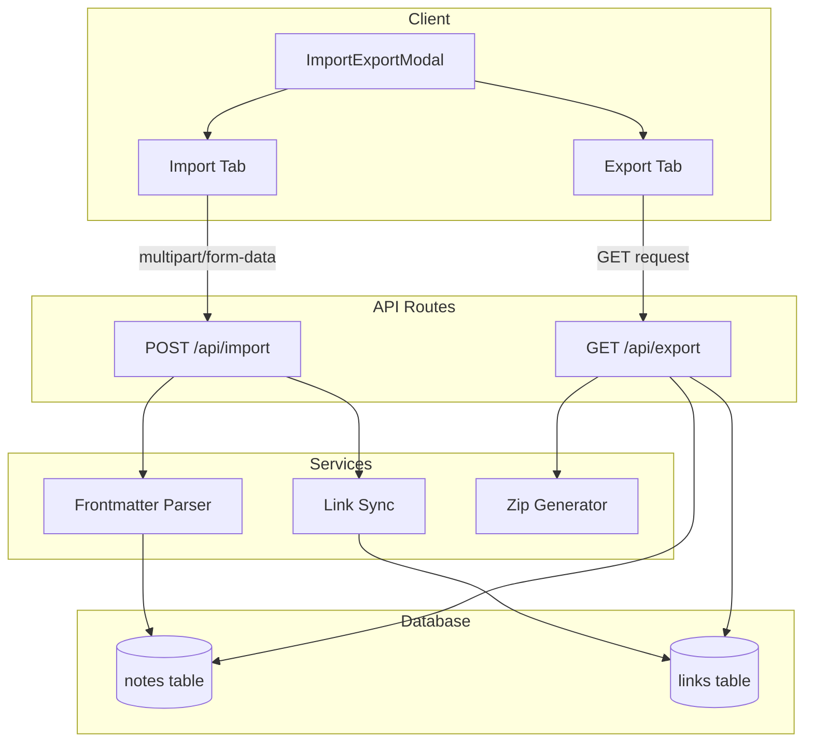

# Design Document: Import/Export Functionality

## Overview

This design implements import/export functionality for NEXUS, enabling users to bulk import markdown files and export all notes as a zip archive. The implementation follows existing patterns in the codebase, using Next.js API routes, Supabase for database operations, and React components with Tailwind CSS.

## Architecture



## Components and Interfaces

### API Routes

#### POST /api/import/route.ts

Handles multipart form data with markdown files.

```typescript
// Request: multipart/form-data with files[] field
// Response:
interface ImportResponse {
  imported: number;
  errors: Array<{
    filename: string;
    error: string;
  }>;
}
```

**Processing Flow:**

1. Parse multipart form data to extract files
2. For each .md file:
   - Parse frontmatter using `gray-matter`
   - Extract title (from frontmatter or filename)
   - Extract tags (from frontmatter, default to empty array)
   - Generate slug using existing `generateSlug()` function
   - Check for slug conflicts
   - Insert note into database
   - Sync wikilinks using existing `syncLinks()` function
3. Return summary with imported count and errors

#### GET /api/export/route.ts

Generates and returns a zip archive of all notes.

```typescript
// Query params:
// - includeBacklinks: boolean (default: false)

// Response: application/zip file download
```

**Processing Flow:**

1. Fetch all notes from database
2. If includeBacklinks requested, fetch all links and compute backlinks per note
3. For each note:
   - Generate frontmatter YAML with title, tags, created_at, updated_at
   - Optionally include backlinks array
   - Combine frontmatter with content
   - Add to zip as `{slug}.md`
4. Return zip with appropriate headers

### UI Component

#### ImportExportModal.tsx

A modal component with two tabs for import and export operations.

```typescript
interface ImportExportModalProps {
  isOpen: boolean;
  onClose: () => void;
}

interface ImportState {
  status: "idle" | "uploading" | "processing" | "complete" | "error";
  progress: number;
  result?: ImportResponse;
}

interface ExportState {
  status: "idle" | "generating" | "complete" | "error";
  includeBacklinks: boolean;
}
```

**UI Structure:**

- Modal overlay with close button
- Tab navigation: "Import" | "Export"
- Import tab:
  - Drag-drop zone with dashed border
  - File input (hidden, triggered by button)
  - Progress indicator during upload
  - Results display (success count, error list)
- Export tab:
  - Checkbox for "Include backlinks in frontmatter"
  - Download button
  - Status indicator

## Data Models

### Frontmatter Schema (Import)

```yaml
---
title: Note Title
tags:
  - tag1
  - tag2
---
```

### Frontmatter Schema (Export)

```yaml
---
title: Note Title
tags:
  - tag1
  - tag2
created_at: 2025-11-26T10:00:00Z
updated_at: 2025-11-26T10:00:00Z
backlinks: # optional
  - linking-note-slug
---
```

### Database Operations

**Import:**

- Uses existing `supabase.from('notes').insert()` pattern
- Uses existing `syncLinks()` from `@/lib/links`
- Checks for conflicts with `supabase.from('notes').select().eq('slug', slug)`

**Export:**

- `supabase.from('notes').select('*')` - fetch all notes
- `supabase.from('links').select('*')` - fetch all links for backlink computation

## Dependencies

### New Dependencies

| Package       | Purpose                              | Version |
| ------------- | ------------------------------------ | ------- |
| `gray-matter` | Parse YAML frontmatter from markdown | ^4.0.3  |
| `jszip`       | Generate zip archives                | ^3.10.1 |

### Existing Dependencies Used

- `@supabase/supabase-js` - Database operations
- `@/lib/links` - `generateSlug()`, `syncLinks()`, `parseWikilinks()`

## Error Handling

### Import Errors

| Error Type                                  | Handling                                               |
| ------------------------------------------- | ------------------------------------------------------ |
| Invalid file type                           | Skip file, add to errors array                         |
| Missing title (no frontmatter, no filename) | Skip file, add to errors array                         |
| Slug conflict                               | Skip file, add to errors with "already exists" message |
| Database error                              | Skip file, add to errors with database message         |
| Malformed frontmatter                       | Use filename as title, continue import                 |

### Export Errors

| Error Type             | Handling                      |
| ---------------------- | ----------------------------- |
| Database fetch failure | Return 500 with error message |
| Zip generation failure | Return 500 with error message |
| Empty database         | Return empty zip file         |

## Testing Strategy

### Unit Tests

1. **Frontmatter parsing**: Test extraction of title, tags from various frontmatter formats
2. **Slug generation from filename**: Test edge cases (spaces, special chars, extensions)
3. **Backlink computation**: Test correct aggregation of links into backlinks

### Integration Tests

1. **Import API**: Test multipart upload, database insertion, link syncing
2. **Export API**: Test zip generation, frontmatter inclusion, backlinks option

### Manual Testing

1. Import files from Obsidian vault
2. Export and verify file contents
3. Re-import exported files (round-trip)

## File Structure

```
src/
├── app/api/
│   ├── import/
│   │   └── route.ts      # POST handler for file import
│   └── export/
│       └── route.ts      # GET handler for zip export
└── components/
    └── ImportExportModal.tsx  # Modal UI component
```
