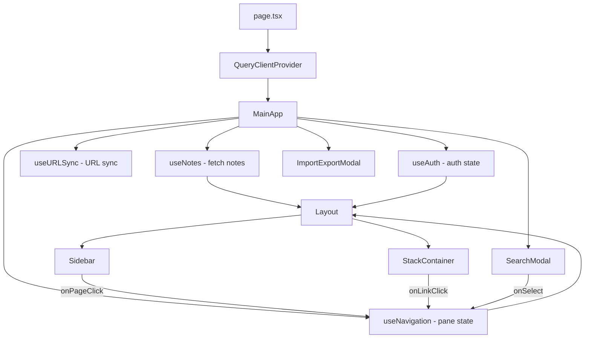

# Design Document

## Overview

This document describes the technical design for updating `/src/app/page.tsx` to serve as the main NEXUS application entry point. The page will be a client component that orchestrates configuration, authentication, data fetching, and rendering of the core UI components with global keyboard shortcuts.

## Architecture

The main page follows a layered architecture:

```
┌─────────────────────────────────────────────────────────────┐
│                    page.tsx (Client Component)               │
├─────────────────────────────────────────────────────────────┤
│  QueryClientProvider                                         │
│  ├── MainApp (orchestration component)                       │
│  │   ├── useNotes() - fetch all notes                       │
│  │   ├── useNavigation() - pane state management            │
│  │   ├── useURLSync() - URL synchronization                 │
│  │   ├── useKeyboardShortcuts() - global shortcuts          │
│  │   │                                                       │
│  │   └── Layout                                              │
│  │       ├── Sidebar                                         │
│  │       └── StackContainer                                  │
│  │           └── Pane[] (note views)                        │
│  │                                                           │
│  │   SearchModal (conditional)                               │
│  │   ImportExportModal (conditional)                         │
└─────────────────────────────────────────────────────────────┘
```

### Data Flow



## Components and Interfaces

### Main Page Component (`page.tsx`)

The page exports a default client component that sets up the QueryClientProvider and renders MainApp.

```typescript
// src/app/page.tsx
"use client";

import { QueryClient, QueryClientProvider } from "@tanstack/react-query";
import { useState } from "react";
import { MainApp } from "./MainApp";

const queryClient = new QueryClient({
  defaultOptions: {
    queries: {
      staleTime: 1000 * 60, // 1 minute
      refetchOnWindowFocus: false,
    },
  },
});

export default function Home() {
  return (
    <QueryClientProvider client={queryClient}>
      <MainApp />
    </QueryClientProvider>
  );
}
```

### MainApp Component

Orchestrates the application state and renders the UI.

```typescript
interface MainAppProps {}

// Internal state
interface MainAppState {
  searchOpen: boolean;
  config: NexusConfig;
}
```

### Keyboard Shortcuts Hook

Custom hook to handle global keyboard shortcuts.

```typescript
interface UseKeyboardShortcutsOptions {
  onSearch: () => void;
  onNewNote: () => void;
  onEscape: () => void;
}

function useKeyboardShortcuts(options: UseKeyboardShortcutsOptions): void;
```

### Component Props Flow

```typescript
// Layout receives
interface LayoutProps {
  config: NexusConfig;
  notes: Note[];
  children: ReactNode;
  onPageClick: (slug: string) => void;
  onNewNote: () => void;
}

// SearchModal receives
interface SearchModalProps {
  isOpen: boolean;
  onClose: () => void;
  onSelect: (slug: string) => void;
  config: NexusConfig;
}

// StackContainer receives
interface StackContainerProps {
  config: NexusConfig;
}
```

## Data Models

### Configuration Loading

Configuration is loaded server-side via `getConfig()` and passed to client components. For the client component, we'll fetch config via API.

```typescript
// Fetch config on client
async function fetchConfig(): Promise<NexusConfig> {
  const res = await fetch("/api/config");
  return res.json();
}
```

### Initial Note Selection

Logic for determining the initial note to display:

```typescript
function getInitialSlug(notes: Note[], config: NexusConfig): string | null {
  // 1. Check URL for existing slugs
  const urlSlugs = parseURLToSlugs(pathname, search);
  if (urlSlugs.length > 0) return null; // URL sync will handle it

  // 2. Look for home/index note
  const homeNote = notes.find((n) => n.slug === "home" || n.slug === "index");
  if (homeNote) return homeNote.slug;

  // 3. Fall back to first note
  if (notes.length > 0) return notes[0].slug;

  return null;
}
```

## Error Handling

### Configuration Errors

- If `/api/config` fails, use default configuration from `DEFAULT_CONFIG`
- Log warning to console but don't block rendering

### Notes Loading Errors

- Display error state in StackContainer
- Allow retry via React Query's built-in retry mechanism

### Authentication Errors

- Handled by AuthProvider in root layout
- MainApp checks `isLoading` state before rendering

## Testing Strategy

### Unit Tests

1. **Keyboard shortcuts hook**: Test that correct callbacks fire for Cmd+K, Cmd+N, Escape
2. **Initial note selection**: Test priority logic (URL > home > first note)

### Integration Tests

1. **Notes loading**: Verify notes load from API and display in sidebar
2. **Pane navigation**: Verify clicking sidebar items opens panes
3. **Search flow**: Verify Cmd+K opens search, selection opens pane
4. **URL sync**: Verify URL updates when panes change

### Manual Testing Checklist

- [ ] Notes load from Supabase on page load
- [ ] Clicking `[[wikilinks]]` opens new panes
- [ ] Edit mode works (toggle, save)
- [ ] Search works (Cmd+K, results, selection)
- [ ] Import/Export modal opens from sidebar
- [ ] Keyboard shortcuts work (Cmd+K, Cmd+N, Escape)
- [ ] URL reflects current pane state
- [ ] Refreshing page restores pane state from URL

## Implementation Notes

### Client Component Requirement

The page must be a client component (`"use client"`) because:

- Uses React hooks (useState, useEffect)
- Accesses browser APIs (window, document)
- Uses React Query hooks

### Provider Hierarchy

The existing root layout already provides:

- `AuthProvider` - authentication context
- `NavigationProvider` - pane navigation context

The page adds:

- `QueryClientProvider` - React Query for data fetching

### Keyboard Event Handling

```typescript
useEffect(() => {
  function handleKeyDown(e: KeyboardEvent) {
    const isMod = e.metaKey || e.ctrlKey;

    // Cmd+K: Open search
    if (isMod && e.key === "k") {
      e.preventDefault();
      setSearchOpen(true);
    }

    // Cmd+N: New note
    if (isMod && e.key === "n") {
      e.preventDefault();
      handleNewNote();
    }

    // Escape: Close modal or rightmost pane
    if (e.key === "Escape") {
      if (searchOpen) {
        setSearchOpen(false);
      } else if (state.panes.length > 1) {
        closePane(state.panes.length - 1);
      }
    }
  }

  document.addEventListener("keydown", handleKeyDown);
  return () => document.removeEventListener("keydown", handleKeyDown);
}, [searchOpen, state.panes.length]);
```

### New Note Creation

```typescript
async function handleNewNote() {
  const title = `Untitled ${Date.now()}`;
  const slug = title.toLowerCase().replace(/\s+/g, "-");

  await createNoteMutation.mutateAsync({
    title,
    slug,
    content: "",
  });

  pushPane(slug);
}
```
