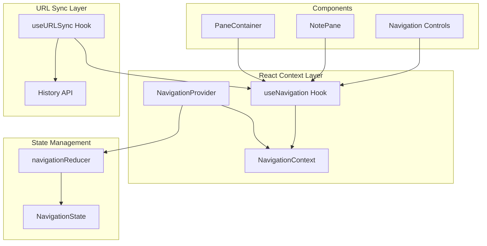
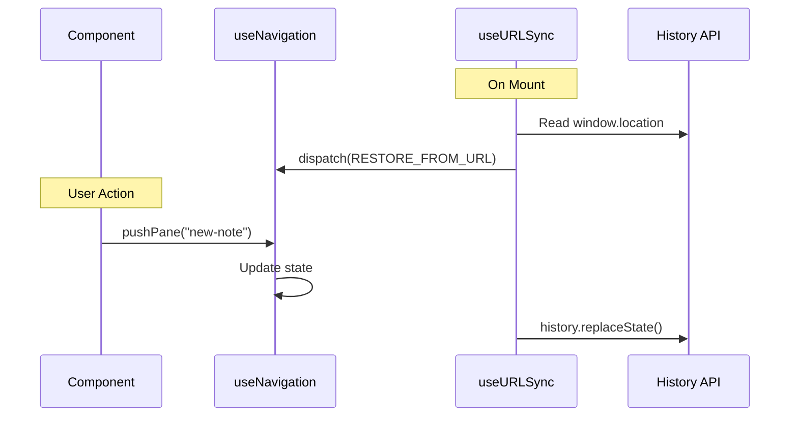

# Design Document: Navigation State Management

## Overview

This design implements a React Context + useReducer-based navigation state management system for multi-pane note viewing. The system manages a stack of panes, each displaying a note identified by slug, with support for view/edit modes. URL synchronization ensures state persistence across page loads and enables shareable links.

## Architecture



## Components and Interfaces

### Types (extend existing src/types/index.ts)

```typescript
// Pane representation (already exists, will reuse)
export interface Pane {
  id: string;
  slug: string;
  mode: "view" | "edit";
  scrollTop: number;
}

// Navigation state (already exists, will reuse)
export interface NavigationState {
  panes: Pane[];
  activePaneIndex: number;
}

// Updated action types for the requested actions
export type NavigationAction =
  | { type: "PUSH_PANE"; slug: string; afterIndex: number }
  | { type: "CLOSE_PANE"; index: number }
  | { type: "SET_ACTIVE"; index: number }
  | { type: "SET_MODE"; index: number; mode: "view" | "edit" }
  | { type: "NAVIGATE_LINEAR"; slug: string; afterIndex: number }
  | { type: "RESTORE_FROM_URL"; slugs: string[] };

// Context value type
export interface NavigationContextValue {
  state: NavigationState;
  dispatch: React.Dispatch<NavigationAction>;
  // Convenience methods
  pushPane: (slug: string, afterIndex?: number) => void;
  closePane: (index: number) => void;
  setActive: (index: number) => void;
  setMode: (index: number, mode: "view" | "edit") => void;
  navigateLinear: (slug: string, afterIndex?: number) => void;
}
```

### useNavigation.ts Structure

```typescript
// File: src/hooks/useNavigation.ts

// 1. NavigationContext - React context for state
const NavigationContext = createContext<NavigationContextValue | null>(null);

// 2. navigationReducer - handles all state transitions
function navigationReducer(
  state: NavigationState,
  action: NavigationAction
): NavigationState;

// 3. NavigationProvider - wraps app, provides state
function NavigationProvider({ children, initialSlug }: NavigationProviderProps);

// 4. useNavigation - hook to access context
function useNavigation(): NavigationContextValue;
```

### useURLSync.ts Structure

```typescript
// File: src/hooks/useURLSync.ts

// Syncs navigation state to URL and restores on mount
function useURLSync(): void;

// Helper: Parse URL to extract slugs
function parseURLToSlugs(pathname: string, search: string): string[];

// Helper: Build URL from slugs
function buildURLFromSlugs(slugs: string[]): string;
```

## Data Models

### State Shape

```typescript
const initialState: NavigationState = {
  panes: [],
  activePaneIndex: 0,
};
```

### Pane Creation Helper

```typescript
function createPane(slug: string): Pane {
  return {
    id: crypto.randomUUID(),
    slug,
    mode: "view",
    scrollTop: 0,
  };
}
```

## Reducer Logic

### PUSH_PANE

1. Slice panes array to keep only panes up to and including `afterIndex`
2. Create new pane with the given slug
3. Append new pane to sliced array
4. Set `activePaneIndex` to the new pane's index

### CLOSE_PANE

1. If index is 0 and only one pane exists, return state unchanged
2. Slice panes array to keep only panes before `index`
3. Clamp `activePaneIndex` to valid range (0 to panes.length - 1)

### SET_ACTIVE

1. Clamp index to valid range (0 to panes.length - 1)
2. Update `activePaneIndex`

### SET_MODE

1. If index is out of range, return state unchanged
2. Update the mode of the pane at the given index

### NAVIGATE_LINEAR

1. Same logic as PUSH_PANE (close panes after afterIndex, add new pane)
2. Set new pane as active

### RESTORE_FROM_URL

1. Create panes for each slug in the array
2. Set `activePaneIndex` to last pane (slugs.length - 1)

## URL Format

| Pane Count | URL Format                  | Example                                         |
| ---------- | --------------------------- | ----------------------------------------------- |
| 1 pane     | `/[slug]`                   | `/getting-started`                              |
| 2+ panes   | `/[slug]?stack=slug2,slug3` | `/getting-started?stack=api-reference,examples` |

### URL Sync Behavior



## Error Handling

| Scenario                          | Handling                             |
| --------------------------------- | ------------------------------------ |
| useNavigation outside Provider    | Throw Error with descriptive message |
| Invalid pane index in SET_MODE    | Ignore action, return current state  |
| Invalid index in SET_ACTIVE       | Clamp to valid range                 |
| CLOSE_PANE on last remaining pane | Keep pane, return current state      |
| Empty slugs in RESTORE_FROM_URL   | Initialize with empty panes array    |

## Testing Strategy

### Unit Tests for Reducer

- Test each action type with various state configurations
- Test edge cases (empty state, single pane, boundary indices)
- Test state immutability

### Integration Tests for Hooks

- Test NavigationProvider renders children
- Test useNavigation throws outside provider
- Test convenience methods dispatch correct actions

### URL Sync Tests

- Test URL parsing with various formats
- Test URL building from state
- Test restoration on mount
- Test URL updates on state changes

## File Structure

```
src/hooks/
├── useNavigation.ts    # Context, Provider, reducer, hook
└── useURLSync.ts       # URL synchronization hook
```

## Integration with Existing Code

The design reuses existing types from `src/types/index.ts`:

- `Pane` interface (id, slug, mode, scrollTop)
- `NavigationState` interface (panes, activePaneIndex)

The `NavigationAction` type will be updated to match the new action signatures while maintaining backward compatibility where possible.

The `NavigationProvider` should wrap the app in `src/app/layout.tsx` to make navigation state available throughout the application.
