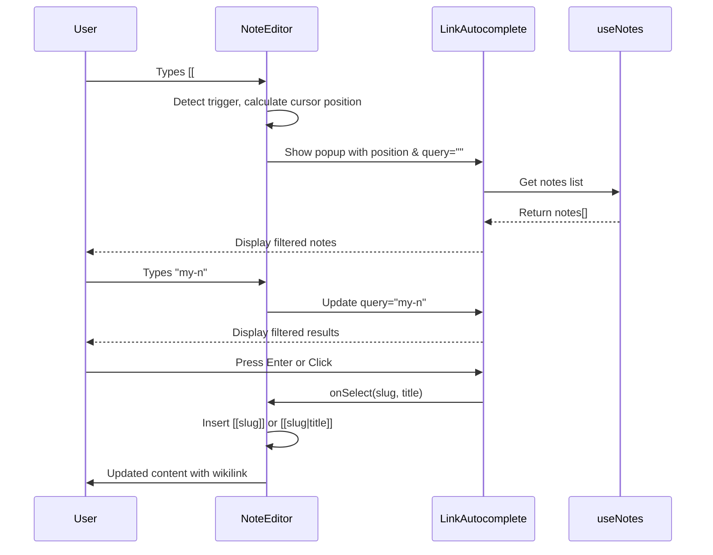

# Design Document: NoteEditor with LinkAutocomplete

## Overview

This design enhances the existing `NoteEditor` component with wikilink autocomplete functionality. The solution introduces a new `LinkAutocomplete` component that appears as a popup when users type `[[` in the textarea, allowing them to quickly search and insert links to existing notes.

The design prioritizes:

- Minimal changes to existing component structure
- Consistent styling with the existing theme system
- Keyboard-first interaction with mouse support
- Clean separation of concerns between editor and autocomplete logic

## Architecture

```
┌─────────────────────────────────────────────────────────────┐
│                      NoteEditor                              │
│  ┌───────────────────────────────────────────────────────┐  │
│  │                    Textarea                            │  │
│  │  - Monitors for [[ trigger                            │  │
│  │  - Handles Cmd+S, Escape shortcuts                    │  │
│  │  - Auto-resizes based on content                      │  │
│  └───────────────────────────────────────────────────────┘  │
│                           │                                  │
│                           ▼                                  │
│  ┌───────────────────────────────────────────────────────┐  │
│  │              LinkAutocomplete (Portal)                 │  │
│  │  - Positioned near cursor                             │  │
│  │  - Filters notes based on query                       │  │
│  │  - Handles arrow key navigation                       │  │
│  │  - Emits selected note slug                           │  │
│  └───────────────────────────────────────────────────────┘  │
└─────────────────────────────────────────────────────────────┘
```

### Data Flow



## Components and Interfaces

### NoteEditor Props (Updated)

```typescript
interface NoteEditorProps {
  /** Initial markdown content */
  content: string;
  /** Called on every content change */
  onChange: (content: string) => void;
  /** Called when user saves (Cmd+S) */
  onSave: () => void;
  /** Called when user cancels (Escape outside autocomplete) */
  onCancel: () => void;
  /** List of existing notes for autocomplete */
  notes: Note[];
  /** Optional: callback when user wants to create a new note from autocomplete */
  onCreateNote?: (title: string) => void;
}
```

### LinkAutocomplete Props

```typescript
interface LinkAutocompleteProps {
  /** Current search query (text after [[) */
  query: string;
  /** List of notes to filter */
  notes: Note[];
  /** Position for the popup */
  position: { top: number; left: number };
  /** Called when a note is selected */
  onSelect: (slug: string, title: string) => void;
  /** Called when popup should close */
  onClose: () => void;
  /** Called when user wants to create a new note */
  onCreateNew?: (title: string) => void;
}
```

### AutocompleteState (Internal)

```typescript
interface AutocompleteState {
  /** Whether the autocomplete popup is visible */
  isOpen: boolean;
  /** Text typed after [[ */
  query: string;
  /** Position of the [[ trigger in the textarea value */
  triggerIndex: number;
  /** Screen coordinates for popup positioning */
  position: { top: number; left: number };
  /** Currently highlighted item index */
  selectedIndex: number;
}
```

## Data Models

The feature uses existing data models from `src/types/index.ts`:

- **Note**: Used for displaying note titles and slugs in autocomplete
- **NexusConfig**: Used for theming the autocomplete popup (colors, fonts)

No new database models are required.

## Component Implementation Details

### NoteEditor Enhancements

1. **Trigger Detection**: Monitor textarea input for `[[` pattern using a regex or string search on each change.

2. **Cursor Position Calculation**: Use a hidden mirror div technique to calculate the pixel position of the cursor for popup placement:

   ```typescript
   // Create a mirror element with same styling as textarea
   // Copy text up to cursor position
   // Measure the position of a marker span
   ```

3. **Keyboard Event Handling**:

   - When autocomplete is open: Arrow keys, Enter, Escape are captured
   - When autocomplete is closed: Cmd+S triggers save, Escape triggers cancel

4. **Link Insertion Logic**:

   ```typescript
   function insertLink(slug: string, title: string, triggerIndex: number) {
     const before = content.slice(0, triggerIndex);
     const after = content.slice(cursorPosition);
     const link =
       slug === title.toLowerCase().replace(/\s+/g, "-")
         ? `[[${slug}]]`
         : `[[${slug}|${title}]]`;
     return before + link + after;
   }
   ```

5. **Auto-resize**: Use `scrollHeight` to dynamically adjust textarea height:
   ```typescript
   useEffect(() => {
     if (textareaRef.current) {
       textareaRef.current.style.height = "auto";
       textareaRef.current.style.height = `${textareaRef.current.scrollHeight}px`;
     }
   }, [content]);
   ```

### LinkAutocomplete Component

1. **Filtering Logic**:

   ```typescript
   const filteredNotes = useMemo(() => {
     const q = query.toLowerCase();
     return notes
       .filter(
         (note) =>
           note.title.toLowerCase().includes(q) ||
           note.slug.toLowerCase().includes(q)
       )
       .slice(0, 10);
   }, [notes, query]);
   ```

2. **Keyboard Navigation**:

   - Maintain `selectedIndex` state
   - Arrow Down: `setSelectedIndex((i) => (i + 1) % items.length)`
   - Arrow Up: `setSelectedIndex((i) => (i - 1 + items.length) % items.length)`
   - Enter: Call `onSelect` with selected item

3. **Create New Option**: When `filteredNotes.length === 0` and `query.length > 0`, show "Create [[query]]" option.

4. **Styling**: Use theme colors from config for consistency:
   ```typescript
   style={{
     backgroundColor: config.theme.colors?.surface,
     borderColor: config.theme.colors?.primary,
     color: config.theme.colors?.text,
   }}
   ```

## Error Handling

| Scenario                      | Handling                                         |
| ----------------------------- | ------------------------------------------------ |
| Empty notes list              | Show "No notes yet" message, offer create option |
| No matching notes             | Show "Create new note" option                    |
| Textarea loses focus          | Close autocomplete popup                         |
| Invalid slug characters       | Sanitize input when creating new note slug       |
| Popup would render off-screen | Adjust position to stay within viewport          |

## Testing Strategy

### Unit Tests

1. **NoteEditor**:

   - Trigger detection: verify `[[` opens autocomplete
   - Link insertion: verify correct format `[[slug]]` vs `[[slug|title]]`
   - Keyboard shortcuts: Cmd+S calls onSave, Escape calls onCancel
   - Auto-resize: textarea height adjusts with content

2. **LinkAutocomplete**:
   - Filtering: case-insensitive matching on title and slug
   - Keyboard navigation: arrow keys cycle through items
   - Selection: Enter/click calls onSelect with correct values
   - Create new: appears when no matches

### Integration Tests

1. Full flow: type `[[`, filter, select, verify inserted link
2. Create new note flow: type `[[new-note`, select create option
3. Cancel flow: open autocomplete, press Escape, verify closed

## File Structure

```
src/components/
├── NoteEditor.tsx          # Enhanced with autocomplete integration
├── LinkAutocomplete.tsx    # New component for the popup
└── index.ts                # Export both components
```

## Styling Approach

The components use:

- Tailwind CSS utility classes for layout and spacing
- Inline styles for theme-based colors (from `config.theme.colors`)
- Monospace font from `config.theme.fonts.code` for the textarea

Popup styling:

```css
/* Popup container */
.link-autocomplete {
  position: fixed;
  z-index: 50;
  max-height: 300px;
  overflow-y: auto;
  border-radius: 8px;
  box-shadow: 0 4px 20px rgba(0, 0, 0, 0.3);
}

/* Selected item */
.link-autocomplete-item.selected {
  background-color: var(--color-primary);
}
```
