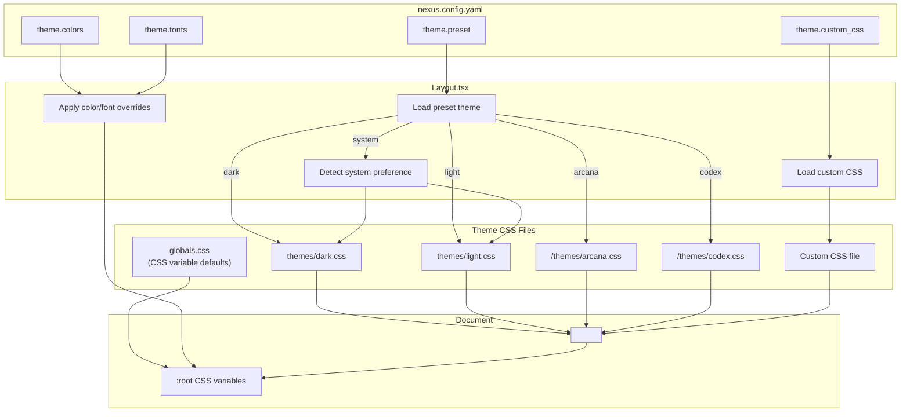

# Theme System Design

## Overview

The Theme System provides a layered theming architecture for NEXUS that enables visual customization through CSS variables. The system supports preset themes (dark, light, arcana, codex), system preference detection, config-based overrides, and custom CSS file loading. All theme values flow through CSS custom properties, enabling dynamic theme switching without page reloads.

## Architecture



## Components and Interfaces

### CSS Variable Schema

All theme values are exposed as CSS custom properties on `:root`:

```css
:root {
  /* Colors */
  --color-primary: #7b2cbf;
  --color-secondary: #1a1a2e;
  --color-accent: #c77dff;
  --color-background: #0a0a0f;
  --color-surface: #16213e;
  --color-text: #e8e6e3;
  --color-text-muted: #a8a6a3;

  /* Fonts */
  --font-heading: "Cinzel", serif;
  --font-body: "Inter", sans-serif;
  --font-code: "JetBrains Mono", monospace;
}
```

### File Structure

```
src/
├── styles/
│   ├── globals.css          # Base styles + CSS variable defaults
│   └── themes/
│       ├── dark.css         # Dark theme overrides
│       └── light.css        # Light theme overrides
themes/
├── arcana.css               # Arcana demo theme (public)
└── codex.css                # Codex demo theme (public)
```

### Theme File Format

Each theme file overrides the CSS variables:

```css
/* Example: themes/dark.css */
:root {
  --color-primary: #7b2cbf;
  --color-secondary: #1a1a2e;
  --color-accent: #c77dff;
  --color-background: #0a0a0f;
  --color-surface: #16213e;
  --color-text: #e8e6e3;
  --color-text-muted: #a8a6a3;
}
```

### Layout Component Theme Logic

The Layout component handles theme loading through a `useTheme` hook pattern:

```typescript
interface ThemeConfig {
  preset: "dark" | "light" | "system" | string;
  colors?: Partial<ThemeColors>;
  fonts?: Partial<ThemeFonts>;
  custom_css?: string;
}

interface ThemeColors {
  primary: string;
  secondary: string;
  accent: string;
  background: string;
  surface: string;
  text: string;
  text_muted: string;
}

interface ThemeFonts {
  heading: string;
  body: string;
  code: string;
}
```

### Theme Loading Flow

1. **Load preset theme**: Import the appropriate CSS file based on `config.theme.preset`
2. **Handle system preference**: If preset is "system", detect OS preference and load dark/light accordingly
3. **Apply config overrides**: Set inline CSS variables for any colors/fonts specified in config
4. **Load custom CSS**: If `custom_css` is specified, inject it via a `<link>` tag

### System Preference Detection

```typescript
// Detect initial preference
const prefersDark = window.matchMedia("(prefers-color-scheme: dark)").matches;

// Listen for changes
window
  .matchMedia("(prefers-color-scheme: dark)")
  .addEventListener("change", (e) => {
    const newTheme = e.matches ? "dark" : "light";
    applyTheme(newTheme);
  });
```

## Data Models

### Theme Preset Mapping

| Preset Value | CSS File Location               | Description                   |
| ------------ | ------------------------------- | ----------------------------- |
| `"dark"`     | `/src/styles/themes/dark.css`   | Default dark theme            |
| `"light"`    | `/src/styles/themes/light.css`  | Light theme                   |
| `"system"`   | Dynamic (dark.css or light.css) | Follows OS preference         |
| `"arcana"`   | `/themes/arcana.css`            | Dark mystical demo theme      |
| `"codex"`    | `/themes/codex.css`             | Light professional demo theme |
| Custom path  | User-specified path             | Custom theme file             |

### Color Palette Definitions

**Dark Theme (default)**
| Variable | Value | Usage |
|----------|-------|-------|
| primary | `#7b2cbf` | Buttons, links, accents |
| secondary | `#1a1a2e` | Secondary backgrounds |
| accent | `#c77dff` | Highlights, hover states |
| background | `#0a0a0f` | Main background |
| surface | `#16213e` | Cards, panels, sidebar |
| text | `#e8e6e3` | Primary text |
| text_muted | `#a8a6a3` | Secondary text, placeholders |

**Light Theme**
| Variable | Value | Usage |
|----------|-------|-------|
| primary | `#6d28d9` | Buttons, links, accents |
| secondary | `#e5e7eb` | Secondary backgrounds |
| accent | `#8b5cf6` | Highlights, hover states |
| background | `#ffffff` | Main background |
| surface | `#f3f4f6` | Cards, panels, sidebar |
| text | `#1f2937` | Primary text |
| text_muted | `#6b7280` | Secondary text, placeholders |

**Arcana Theme**
| Variable | Value | Usage |
|----------|-------|-------|
| primary | `#9333ea` | Purple mystical accent |
| secondary | `#1e1b4b` | Deep indigo |
| accent | `#a855f7` | Bright purple |
| background | `#0c0a1d` | Near-black with purple tint |
| surface | `#1e1b4b` | Dark indigo panels |
| text | `#e9d5ff` | Light purple text |
| text_muted | `#a78bfa` | Muted purple |

**Codex Theme**
| Variable | Value | Usage |
|----------|-------|-------|
| primary | `#2563eb` | Professional blue |
| secondary | `#dbeafe` | Light blue |
| accent | `#3b82f6` | Bright blue |
| background | `#f8fafc` | Off-white |
| surface | `#ffffff` | Pure white panels |
| text | `#0f172a` | Near-black text |
| text_muted | `#64748b` | Slate gray |

## Error Handling

| Scenario                          | Handling                                |
| --------------------------------- | --------------------------------------- |
| Invalid preset value              | Fall back to "dark" theme               |
| Custom CSS file not found         | Log warning, continue with preset theme |
| Invalid color value in config     | Skip that override, use preset value    |
| System preference API unavailable | Fall back to "dark" theme               |

### Error Logging

```typescript
// Custom CSS load failure
console.warn(`[Theme] Failed to load custom CSS: ${customCssPath}`);

// Invalid preset fallback
console.warn(`[Theme] Unknown preset "${preset}", falling back to "dark"`);
```

## Testing Strategy

### Unit Tests

1. **CSS Variable Application**

   - Verify all CSS variables are set on document root
   - Verify color override values are applied correctly
   - Verify font override values are applied correctly

2. **System Preference Detection**

   - Mock `matchMedia` to test dark preference detection
   - Mock `matchMedia` to test light preference detection
   - Test preference change listener triggers theme update

3. **Theme Loading**
   - Verify correct CSS file is loaded for each preset
   - Verify custom CSS path is injected when specified
   - Verify fallback behavior for invalid presets

### Integration Tests

1. **Layout Component**
   - Render with dark preset, verify dark theme applied
   - Render with light preset, verify light theme applied
   - Render with color overrides, verify overrides take precedence
   - Render with custom_css, verify custom styles loaded

### Visual Regression Tests (Manual)

1. Verify each theme renders correctly across all components
2. Verify color contrast meets accessibility standards
3. Verify theme transitions are smooth (no flash of unstyled content)
